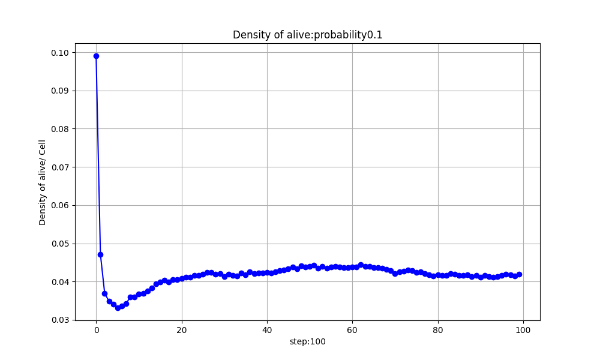
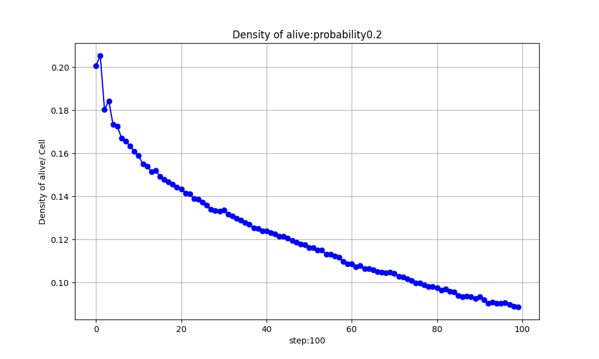
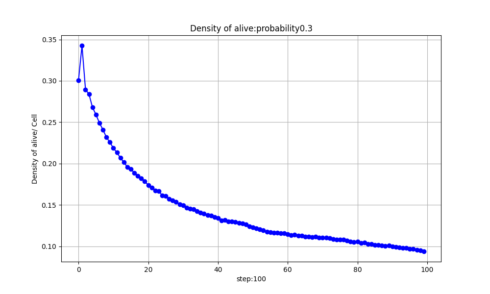
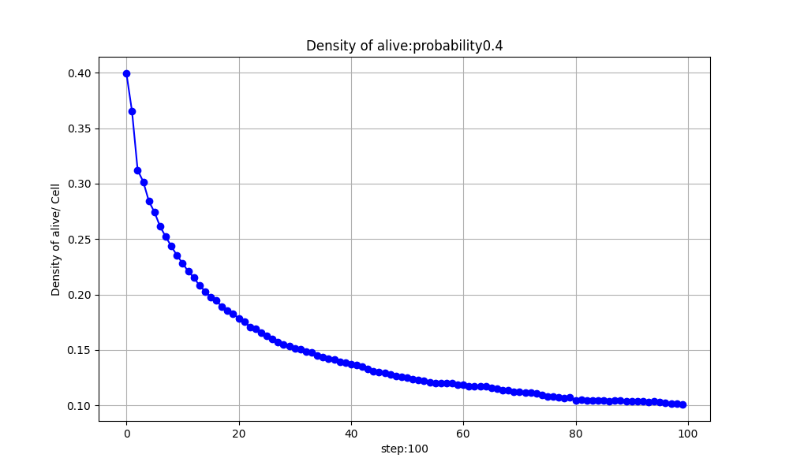
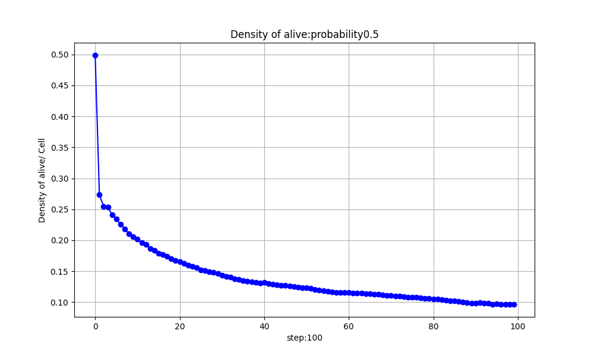

# conway-game-of-life-analysis

このリポジトリは、ライフゲームの初期状態として死んだセルと生きたセルの発生確率をパラメータとして実行し、  
各ステップで1セルあたりの生きているセルの個数の推移を観察するためにグラフを描画するスクリプトを含んでいます。







## ファイル構成

- `main.py`: メインスクリプト。シミュレーションの実行と結果の保存を行います。
- `config.yaml`: シミュレーションの設定ファイル。
- `life_game_convolution.py`: 畳み込み演算によるライフゲームの実装。
- `life_game_analyzer.py`: ライフゲームの解析および結果の保存を行うクラス。

## 使い方

1. リポジトリをクローンします。

    ```bash
    git clone https://github.com/yokyomitsu/conway-game-of-life-analysis.git
    cd conway-game-of-life-analysis
    ```

2. 必要なPythonパッケージをインストールします。

    ```bash
    pip install -r requirements.txt
    ```

3. `config.yaml`を編集してシミュレーションのパラメータを設定します。

    ```yaml
    size: 100  # グリッドサイズ
    max_t: 1000  # 最大ステップ数
    from_showing_graph: False  # グラフ表示の有無
    save_path: 'simulation_results'  # 結果保存パス
    ```

4. メインスクリプトを実行してシミュレーションを開始します。

    ```bash
    python main.py
    ```

## 設定パラメータ

- `size`: グリッドのサイズ（NxN）。
- `max_t`: シミュレーションの最大ステップ数。
- `from_showing_graph`: シミュレーション中にグラフを表示するかどうか。
- `save_path`: シミュレーション結果を保存するディレクトリのパス。

## スクリプトの説明

### load_config

`config.yaml`ファイルを読み込み、設定を辞書形式で返します。

### run_convolution_simulation

畳み込み演算によるライフゲームのシミュレーションを実行し、結果を返します。

### set_probabilities

セルの発生確率を設定します。

### run_and_save_all

設定に基づいてシミュレーションを実行し、結果を保存します。

### save_all_densities

シミュレーション結果を基に密度グラフを保存します。

### analyze_density

シミュレーションを実行し、結果の解析と密度グラフの保存を行います。

### main

メイン関数。シミュレーションの実行と結果の解析を行います。

## ライセンス

このプロジェクトはMITライセンスの下で公開されています。詳細は`LICENSE`ファイルを参照してください。
